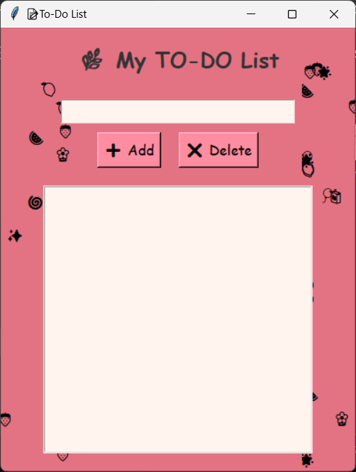

# 📝 TO-DOodle List App 

A cute and quirky desktop to-do list built with Python and Tkinter!

## 📸 Preview

## 🚀 Features
- Add tasks ✅
- Mark tasks as completed ✅
- Delete tasks 🗑️
- GUI with Tkinter 🎨

## 🔗 Links
- 📁 [Source Code (GitHub)](https://github.com/sudhaamayee/todolist)
